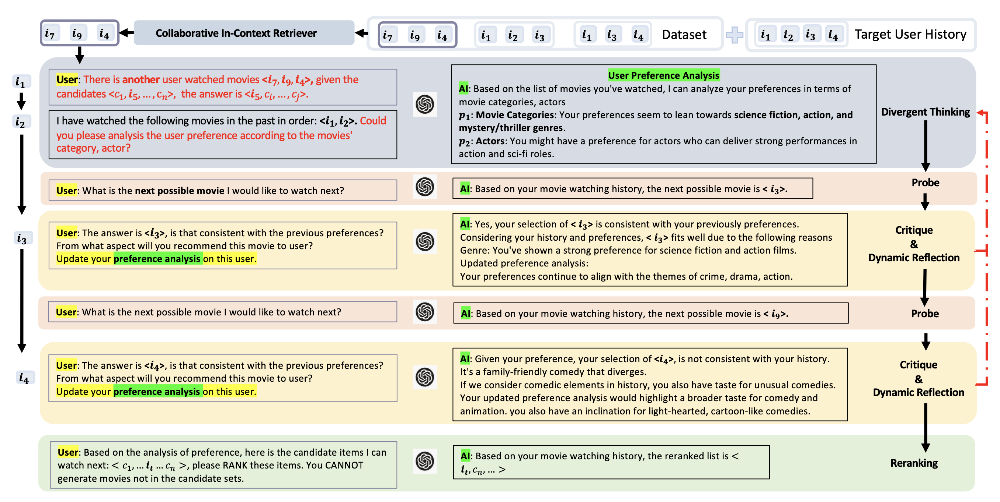
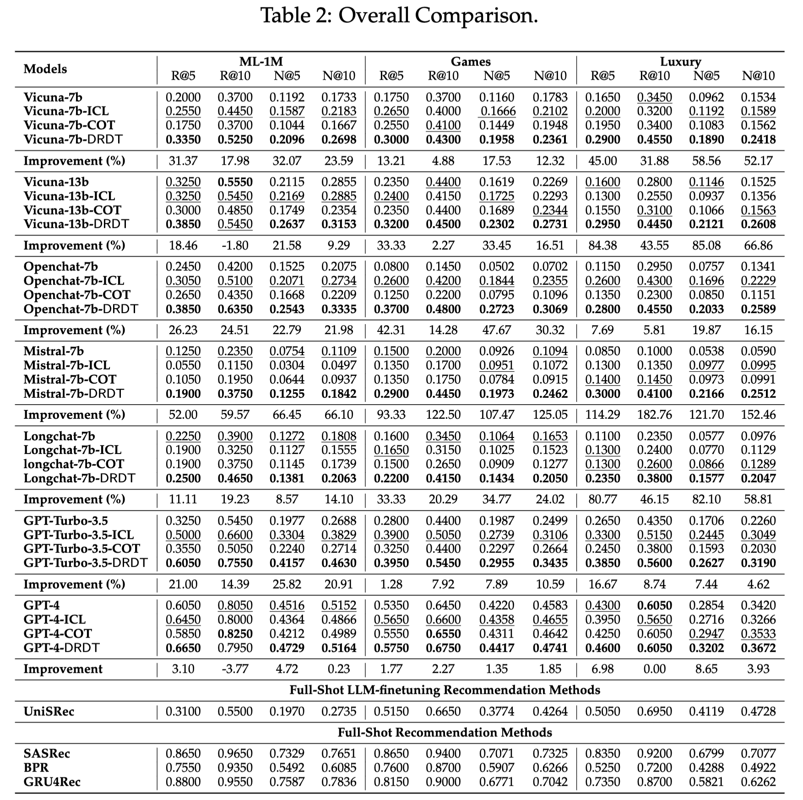

# DRDT Framework

# Updated Overall Comparison via Adding FULL-SHOT Recommendation Methods

# Running Code
my_evaluate.py --d Luxury --model_version COT_reflex_long --m LLM_GPT --inference_model gpt-4 --reflex_step 3
